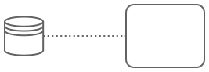

---
# This is a comment, which might be helpful to explain the concept of help texts
title: Data Input Association
---

# Data Input Association

A `Data Input Association` is used to connect a [Data Object](help://bpmn/properties/data_object) or [Data Store Reference](help://bpmn/properties/data_store) to an activity or event.
