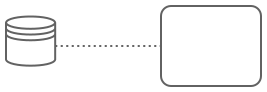

---
# This is a comment, which might be helpful to explain the concept of help texts
title: Data Output Association
---

# Data Output Association

`Data Output Association` are used to write data from an `Activity` or `Event` to a [Data Object](help://bpmn/properties/data_object).
