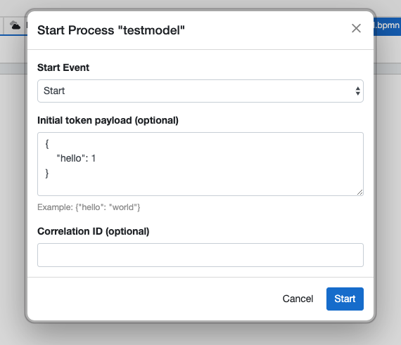

# Default Configured Start Payload

The `Default Configured Start Payload` is a Studio convenience for modeling. It pre-fills the `Payload` field of the **Configured Start** dialog, so you do not have to retype the same sample data every time you start the process from the Studio.

It is remembered on the Start Event for use inside the Studio only — it is not part of the deployed process and does not change how the process actually runs.

Example — this payload:

```json
{
  "hello": 1
}
```

pre-fills the **Configured Start** dialog:


