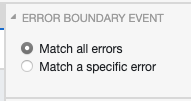
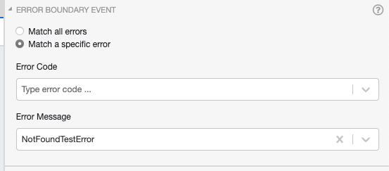

---
# This is a comment, which might be helpful to explain the concept of help texts
title: Error Boundary Event
---

# Error Boundary Event


The `Error Boundary Event` is a specialized [Boundary Event](help://bpmn/properties/boundary_event) that is triggered if the attached `Activity` throws an `Error`.
It is possible to attach multiple `Error Boundary Events` to the same `Activity`, to provide specific paths for individual errors.
An `Error Boundary Event` is triggered when the `Error Code` and/or `Error Message` of the caught error match the definitions modeled on the `Error Boundary Event`.

Errors thrown by flow nodes are defined with `evil:errorCode` and `evil:errorMessage` on the `<bpmn:errorEventDefinition>` extension elements.

To match all `Errors` thrown by the `Activity`, the `Error Boundary Event` must be configured to `Match all errors`

Example:



## Match a specific Error

To catch only specific errors, `Error Code` or `Error Message` must be set. If both are set, then the error must have a matching `Error Code` **and** a matching `Error Message`.

### Example

An activity throws an error with code `404` and message `NotFoundTestError` (via `evil:errorCode` and `evil:errorMessage` on an Error End Event or error-throwing handler):

```feel
{ errorCode: "404", errorMessage: "NotFoundTestError" }
```

An `Error Boundary Event` is attached to the activity and has the following configuration:



The `Error Boundary Event` would not catch the error, because the `Error Code` does not match.
If we change the configuration of the `Error Code` to `404`, then the error would be caught and the Boundary Event would be triggered.
